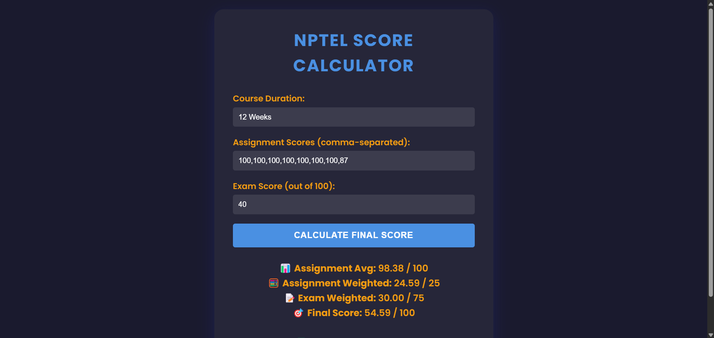

# 📊 NPTEL Assignment Score Calculator

A simple, responsive web-based tool to **calculate your final NPTEL course score** based on your assignment and exam marks. It also checks **certificate eligibility** based on NPTEL's official criteria.


<!-- Optional: Replace with actual screenshot -->

---

## 🌟 Features

- ✅ **Modern UI** – Sleek, clean interface with responsive design  
- ✅ **Dynamic Calculation** – Real-time score updates  
- ✅ **Error Handling** – Input validation for user mistakes  
- ✅ **Certificate Eligibility Checker** – Determines if you're qualified  
- ✅ **100% Client-Side** – No backend, works instantly offline  

---

## 📌 How It Works

1. **Select Course Duration**: 4, 8, or 12 weeks  
2. **Enter Assignment Scores**: Comma-separated values (e.g. `85, 90, 78`)  
3. **Enter Exam Score**: Out of 100  
4. **Click “Calculate Final Score”**

### 🎯 The App Calculates:
- **Assignment Average** based on best scores:
  - Top 3 for 4-week courses
  - Top 6 for 8-week courses
  - Top 8 for 12-week courses
- **Final Score**:  
  - Assignments = 25%  
  - Exam = 75%
- **Certificate Eligibility**:
  - Min 10/25 in assignments  
  - Min 30/75 in exam  
  - Total ≥ 40/100

---

## 🚀 Live Demo

👉 **[Try it Live]([https://yourusername.github.io/nptel-score-calculator/](https://dinesh2841.github.io/NPTEL-Assignment-Score-Calculator2.0/))**  
_(Replace with your GitHub Pages or CodePen link)_

---

## 🛠️ Tech Stack

- **HTML5** – Semantic markup  
- **CSS3** – Modern styling with glassmorphism  
- **JavaScript** – Core logic + validations

---

## 📥 Installation

Clone the repository:

```bash
git clone [https://github.com/yourusername/nptel-score-calculator](https://github.com/DINESH2841/NPTEL-Assignment-Score-Calculator2.0).git
cd nptel-score-calculator
